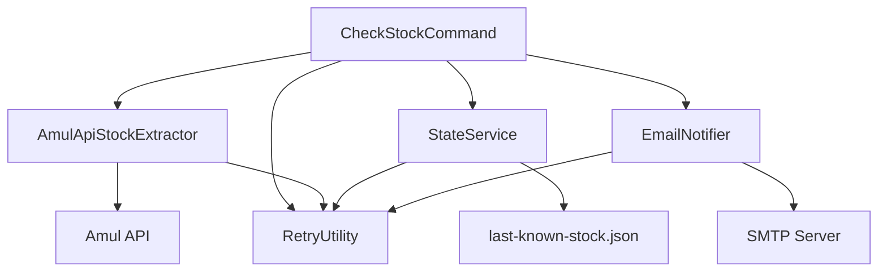

# 🛒 Amul Stock Radar

A smart, Java-based stock monitoring system that tracks Amul protein products and sends intelligent email notifications when items come back in stock.

## ✨ Features

- **🔍 Smart Monitoring**: Tracks all protein products OR specific products from shop.amul.com using their real API
- **🎯 Selective Monitoring**: Optional feature to watch only specific products you care about
- **📧 Email Notifications**: Sends alerts only when products transition from out-of-stock to in-stock
- **🧠 State Management**: Prevents notification spam by remembering previous stock levels
- **🔄 Retry Logic**: Robust error handling with exponential backoff for network issues
- **⚙️ Configurable**: Easy setup with YAML configuration and environment variables
- **🎯 Bidirectional Alerts**: Notifications for both restocks (high priority) and sell-outs (normal priority)

## 🚀 Quick Start

### Prerequisites

- **Java 17+** - [Download here](https://adoptium.net/)
- **Maven 3.6+** - [Installation guide](https://maven.apache.org/install.html)
- **Email Account** - Gmail or Outlook with app-specific password

### 1. Clone and Build

```bash
git clone <repository-url>
cd restock-radar
mvn clean package
```

### 2. Configure Email (Optional but Recommended)

For **Gmail**:
1. Enable 2-Factor Authentication
2. Generate an [App Password](https://support.google.com/accounts/answer/185833)
3. Set environment variables:

```bash
export SMTP_USERNAME="your.email@gmail.com"
export SMTP_PASSWORD="your_app_password"
```

For **Outlook/Hotmail**:
```bash
export SMTP_USERNAME="your.email@outlook.com"
export SMTP_PASSWORD="your_password"
```

### 3. Update Configuration

Edit `config.yml` to set your notification email:

```yaml
email:
  recipient: "your.notification.email@example.com"
```

### 4. Run the Application

```bash
# Using the convenient runner script
./run-stock-checker.sh

# Or directly with Java
java -jar target/restock-radar-1.0-SNAPSHOT.jar check-stock
```

## 📖 Detailed Setup

### Environment Variables

| Variable | Description | Required | Example |
|----------|-------------|----------|---------|
| `SMTP_USERNAME` | Your email address for SMTP authentication | Yes* | `your.email@gmail.com` |
| `SMTP_PASSWORD` | Your email password or app-specific password | Yes* | `abcd efgh ijkl mnop` |

*Required only if you want email notifications. The application will run without them but won't send alerts.

### Configuration File (config.yml)

```yaml
# Logging configuration
logging:
  level: INFO
  loggers:
    com.radar.stock: DEBUG

# Product monitoring configuration (OPTIONAL)
# By default, all protein products are monitored.
# Uncomment and specify product aliases below to monitor only specific products.
# watchedProducts:
#   - "amul-protein-buttermilk-200ml"
#   - "amul-high-protein-lassi-250ml"
#   - "amul-protein-drink-chocolate-200ml"

# Email notification settings
email:
  # SMTP server settings (Gmail by default)
  host: "smtp.gmail.com"
  port: 587
  enableTLS: true
  enableSSL: false
  
  # Notification settings
  recipient: "your.notification.email@example.com"
  senderName: "Amul Stock Radar"
  enabled: true
```

### Selective Monitoring

By default, the application monitors **all protein products** available on Amul's website. However, you can configure it to watch only specific products:

**Step 1: Find Product Aliases**
Run the application once to see all available products and their aliases:
```bash
./run-stock-checker.sh
```

**Step 2: Configure Specific Products**
Edit `config.yml` and uncomment the `watchedProducts` section:
```yaml
watchedProducts:
  - "amul-protein-buttermilk-200ml"
  - "amul-high-protein-lassi-250ml"
  - "amul-protein-drink-chocolate-200ml"
```

**Step 3: Run with Selective Monitoring**
```bash
./run-stock-checker.sh
```

The application will now show:
- 🎯 **Selective Monitoring Mode** - Only watches your specified products
- 📝 **Watched products list** - Shows which products are being monitored

### Alternative Email Providers

**Outlook/Hotmail**:
```yaml
email:
  host: "smtp-mail.outlook.com"
  port: 587
  enableTLS: true
  enableSSL: false
```

**Yahoo Mail**:
```yaml
email:
  host: "smtp.mail.yahoo.com"
  port: 587
  enableTLS: true
  enableSSL: false
```

## 🔧 Runner Script Usage

The `run-stock-checker.sh` script provides convenient ways to run the application:

```bash
# Normal execution
./run-stock-checker.sh

# Check prerequisites only
./run-stock-checker.sh --check-only

# Show current system status
./run-stock-checker.sh --status

# Reset state (start fresh)
./run-stock-checker.sh --clean

# Show help
./run-stock-checker.sh --help
```

### Script Features

- ✅ **Prerequisite Checking**: Validates Java version, JAR file, and configuration
- 🔍 **Environment Validation**: Checks for required environment variables
- 📊 **Status Display**: Shows current system state and file information
- 🎨 **Colored Output**: Clear, colored console output for better readability
- 🛡️ **Error Handling**: Graceful error handling with helpful error messages

## 🏗️ Architecture

### Components



### Core Classes

- **`CheckStockCommand`**: Main application entry point and workflow orchestration
- **`AmulApiStockExtractor`**: Fetches real-time product data from Amul's API
- **`StateService`**: Manages persistent state to prevent duplicate notifications
- **`EmailNotifier`**: Handles email delivery with retry logic
- **`RetryUtility`**: Provides standardized retry mechanisms with exponential backoff

## 📊 How It Works

### 1. State Management

The application maintains a `last-known-stock.json` file that tracks the previous stock status of all monitored products. This enables intelligent notifications:

```json
[
  {
    "name": "Amul Protein Buttermilk",
    "alias": "amul-protein-buttermilk-200ml",
    "available": true,
    "inventoryQuantity": 25
  }
]
```

### 2. Smart Notifications

Notifications are sent only when products **transition** between states:

- **🎉 Restock Alert (High Priority)**: When a product goes from out-of-stock → in-stock
- **📉 Sell-out Alert (Normal Priority)**: When a product goes from in-stock → out-of-stock

### 3. Retry Logic

The application includes robust retry mechanisms:

- **API Calls**: 3 attempts with 1s → 2s → 4s delays
- **Email Delivery**: 3 attempts with 2s → 3s → 4.5s delays  
- **File Operations**: 2 attempts with 0.5s → 1s delays

## 🔄 Automation

### Cron Job Setup

To run the stock checker automatically every hour:

```bash
# Edit your crontab
crontab -e

# Add this line (adjust path as needed)
0 * * * * cd /path/to/restock-radar && ./run-stock-checker.sh >> stock-checker.log 2>&1
```

### Systemd Timer (Linux)

Create `/etc/systemd/system/stock-checker.service`:

```ini
[Unit]
Description=Amul Stock Checker
After=network.target

[Service]
Type=oneshot
User=your-username
WorkingDirectory=/path/to/restock-radar
Environment=SMTP_USERNAME=your.email@gmail.com
Environment=SMTP_PASSWORD=your_app_password
ExecStart=/path/to/restock-radar/run-stock-checker.sh
```

Create `/etc/systemd/system/stock-checker.timer`:

```ini
[Unit]
Description=Run stock checker every hour
Requires=stock-checker.service

[Timer]
OnCalendar=hourly
Persistent=true

[Install]
WantedBy=timers.target
```

Enable and start:
```bash
sudo systemctl enable stock-checker.timer
sudo systemctl start stock-checker.timer
```

## 🚀 Automation with GitHub Actions

This project includes a pre-configured GitHub Actions workflow to automate the stock checking process. The workflow, located at `.github/workflows/stock-check.yml`, will run automatically on a schedule and can also be triggered manually.

### Features
- **Scheduled Runs**: Automatically checks for stock every 6 hours.
- **Manual Runs**: Trigger a stock check anytime from the GitHub "Actions" tab.
- **Secure**: Uses GitHub's encrypted secrets to store your sensitive email credentials.
- **Debugging**: Saves the `last-known-stock.json` file as an artifact from each run, so you can track what the application sees.

### Setup Instructions

To enable the automated workflow, you need to add your SMTP credentials as secrets to your GitHub repository.

1.  **Navigate to your repository on GitHub.**
2.  Go to **Settings** > **Secrets and variables** > **Actions**.
3.  Click the **New repository secret** button for each of the secrets below.

#### Required Secrets

You must create the following two secrets:

-   **`SMTP_USERNAME`**:
    -   **Value**: Your SMTP username (usually your full Gmail address, e.g., `your.email@gmail.com`).

-   **`SMTP_PASSWORD`**:
    -   **Value**: Your SMTP password. For Gmail, this **must be an App Password**.

> **Important**: For security reasons, never hardcode your credentials in the workflow file or any other part of the codebase. Always use GitHub Secrets.

### How it Works

-   **On a schedule (`cron`)**: The job runs every 6 hours automatically.
-   **On push**: The job runs on every push to the `main` branch to ensure the workflow is not broken.
-   **Manually (`workflow_dispatch`)**: You can go to the "Actions" tab in your repository, select the "Amul Stock Check" workflow, and click "Run workflow" to start a new check immediately.

Once set up, the workflow will handle everything, and you will receive email notifications for any stock changes directly from your GitHub repository, running on autopilot!

## 🛠️ Development

### Building

```